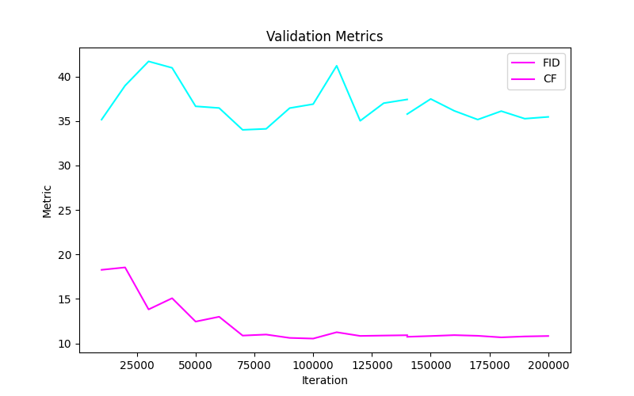

# ddcolor_dl_final
## Dual Decoder Colorization - Extended Applications
This repository contains the implementation and results of our research project that extends the dual decoder architecture from the "DDColor: Towards Photo-Realistic Image Colorization via Dual Decoders" paper. We explore the versatility of this model by applying it to diverse tasks, including historical film restoration and artistic stylized color transfer.
Highlights

#### Replication of the original DDColor model's results using prescribed methodologies and datasets.

- Replication of the original DDColor model's results using prescribed methodologies and datasets.
- Training the model from scratch on the Tiny ImageNet and WikiArt datasets for general and stylized image colorization tasks, respectively.
- Achieved high-fidelity restoration of historical black and white images.
- Effective style transfer in colorization by adopting characteristics of impressionist art.
- Seamless integration and reproduction of color nuances influenced by impressionism, enabling creative colorization in digital media.

## Repo Includes 
In this repo we include the full training codes and pipeline to recreate our results, we also provide the training logs and plotting function to infer the data and also the weights for our pre trained models for both datasets of ImageNet-Tiny and Impressions-WikiArt.
### Requirements

- Python >= 3.8
- PyTorch >= 1.7

### Install with conda (Recommend)
The repository for DDColor suggests runnign with python 3.9, But we found usage with python 3.10.12 was smoother.
```
conda create -n ddcolor python=3.10
conda activate ddcolor
pip install -r requirements.txt

python3 setup.py develop  # install basicsr
```
## Training

### Create a Directory called data_list (Train.py directly refers to this) and 
- To train the Model make sure the basicsr package is intalled and unzipped
- Create train and val folders and add your respective data in data_list/train and data_list/val
- from the root directory run the following commands
```
sh scripts/train.sh
```
## Inference/Testing
- make sure all your test images are present in /assets/test_images
- - Before running the commands check the scripts/inference.sh file to make sure --model-path --input --output-path are correctly speicified as your required to see the results
- Run the following commands
```
sh scripts/inference.sh
```
# Value Params 
As we have trained both on laptop and the HPC the params provided are for laptop training with 1 GPU , 32 batch size and 4 processes per node. you can optimize these based on needs.
# DD-Color
<p align="center">
  
</p>

🪄 DDColor can provide vivid and natural colorization for historical black and white old photos.
🎲 It can even colorize/recolor landscapes from anime games, transforming your animated scenery into a realistic real-life style! (Image source: Genshin Impact)

## Inputs

<table>
  <tr>
    <td>
      
    </td>
    <td>
      
    </td>
    <td>
      
    </td>
    <td>
      
    </td>
  </tr>
</table>

## Outputs

### Style Transfer Results with Impressions Wiki Art Trained Model

Download the model pre-trained weights at [Impressions200k](https://drive.google.com/file/d/1wP-C_aeLVbrQvS03mO4GtTbxBxKyroh-/view?usp=sharing) . This model was trained on 200k iterations.
<table>
  <tr>
    <td>
      
    </td>
    <td>
      
    </td>
    <td>
      
    </td>
    <td>
      
    </td>
  </tr>
</table>

### Colored Results with ImageNet Tiny Trained Model

Download Model Pretrained weights at [ImageNetTiny100k](https://drive.google.com/file/d/1FqggCk8fpHMs3-3IgUIO7ZM4LqC_rtpq/view?usp=drive_link) . This model was trained on 100k iterations.
<table>
  <tr>
    <td>
      
    </td>
    <td>
      
    </td>
    <td>
      
    </td>
    <td>
      
    </td>
  </tr>
</table>
Using the model we also performed 

# Pre-testing

DDCOlor uses ConvNext-Net Pretrained weights for the backbone of the encoder to extract the image features. Download them from the link.
Download pretrained weights for [ConvNeXt](https://dl.fbaipublicfiles.com/convnext/convnext_large_22k_224.pth) and [InceptionV3](https://download.pytorch.org/models/inception_v3_google-1a9a5a14.pth) and put it into `pretrain` folder.

# Implementation 
## The results after Training Obtained on the Impressions Dataset
<table>
  <tr>
    <td>
      
    </td>
    <td>
      
    </td>
  </tr>
  <tr>
    <td>
      
    </td>
    <td>
      
    </td>
  </tr>
</table>

## VIddeo Colorization Results
### Input Black and White Video Frames


### Output Colored Video frames with model trained on ImageNet-Tiny
[Link to Video](https://drive.google.com/file/d/10JzU-vz3rNd11aDkEMlCpb51iFrQNi1K/view?usp=drive_link)


### Output Colored Video frames with model trained on Immpressions-WikiArt
[Link to Video](https://drive.google.com/file/d/1rmOeo0iI1qFtU5-eAN3WrJ5GIatXcGo4/view?usp=drive_link)


## Acknowledgments
We thank the authors of BasicSR for the awesome training pipeline.
